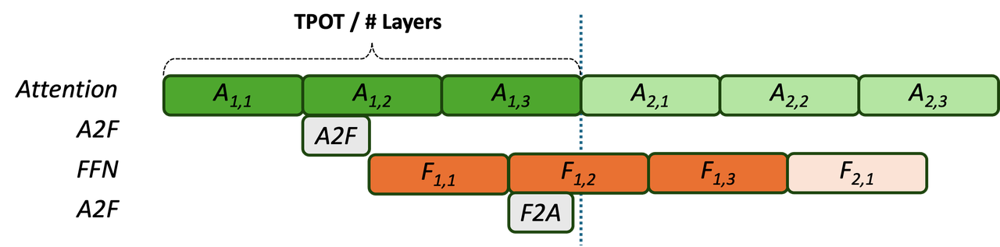
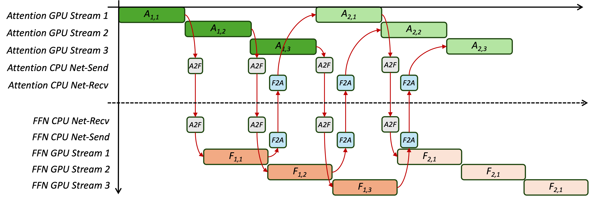
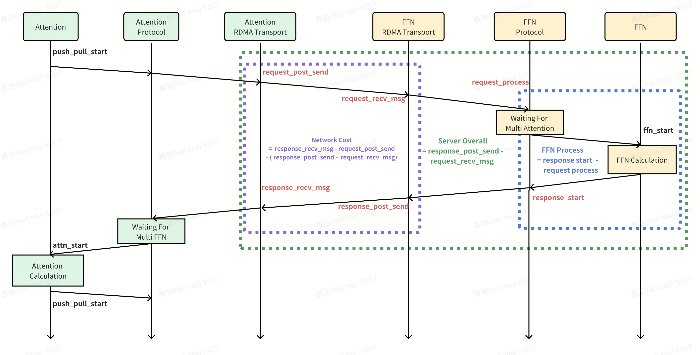

# StepMesh: A Communication Library for Attention-FFN Disaggregation

## Overview

Following the release of the [Step-3 Technical Report](https://arxiv.org/abs/2507.19427), we have received numerous inquiries regarding the specifics of the Attention-FFN Separation approach, with many questions focused on our open-source communication library, [StepMesh](https://github.com/stepfun-ai/StepMesh). This article delves into the technical details and design choices of StepMesh, sharing our insights and considerations regarding the communication requirements for AF Separation systems.

AFD imposes stringent latency requirements on communication libraries. For a 3-stage AFD pipeline, meeting an end-to-end SLA of 20 Tokens/s necessitates completing all data transfers between Attention and FFN instances within **272us** (the rationale behind the 273us mentioned earlier is explained in the second part of this document). Additionally, existing communication libraries like NCCL and DeepEP introduce extra communication Stream Multiprocessor (SM) occupancy overhead, impacting the computation speeds of both Attention and FFN.

AFD also introduces a novel bipartite graph communication pattern, which differs from traditional collective communication interfaces such as AllReduce and AllToAll. Current collective communication libraries lack robust support for bipartite graph communication. Although workarounds like ncclSend/ncclRecv can be employed, they inevitably compromise performance.

To address these challenges, we developed StepMesh — a communication library tailored for AFD, leveraging GPUDirect RDMA. StepMesh offers:

- **Low Latency**: Optimized for rapid data transfers to meet the tight timing constraints of AFD.
- **Zero SM Occupancy**: Minimizes the impact on computational resources by avoiding unnecessary SM usage during communication.
- **Flexible Bipartite Graph Communication**: Supports the unique communication pattern required by AFD, enhancing efficiency and performance.

Through a deep understanding of the AFD communication pattern, we identified that **BytePS** could be seamlessly adapted to meet AFD's communication needs. Therefore, we extended the BytePS codebase while preserving all historical commits. For foundational communication components, we aimed to build incrementally on existing work rather than reinventing the wheel. **MegaScale-Infer** also provided valuable reference designs for the MxN communication library in AFD systems. Drawing from these inspirations, we designed the communication timeline for AFD to meet the stringent low-latency requirements of the Step-3 inference traffic characteristics. Beyond the core communication features, we are actively exploring and mitigating the Straggler problem—a significant performance bottleneck in AFD systems. Additionally, we are investigating and applying other technological advancements, including:

- IBGDA (InfiniBand GPUDirect Async): Enhancing asynchronous communication capabilities to further reduce latency.
- Multi-Backend Architecture: Supporting diverse communication backends to improve flexibility and performance across various hardware environments.

## Traffic Characteristics of Attention-FFN Disaggregation

**
Figure 1: 1A1F 3-Stage Pipe For Communication Constraints Illustration
**

Before delving into the traffic characteristics of AFD, let's first examine the communication constraints of AFD. To simplify the analysis (without compromising generality), we'll use the 1A1F 3-stage pipeline depicted in Figure 1 for our discussion. In Figure 1, $A_{1,1}$ and $A_{1,2}$ represent the computation times for Microbatch 1 and 2 of Layer 1, respectively. To meet the SLA requirement of 20 Tokens/s, the Time Per Output Token (TPOT) must be less than 50ms. This implies that the computation and communication overhead for each layer should be less than 50ms /# Layers. Given that Step-3 has 61 layers, the overhead per layer must be less than 819us. Therefore, we have:

$$A_{1,1} + A_{1,2} + A_{1,3} \le 819us$$

Since the microbatches are of equal size, it follows that:

$$A_{x,y} \le 273us$$

This reasoning applies analogously to the FFN side. When accounting for communication, it's important to note that $A_{1,1}$ and $A_{2,1}$ have data dependencies. Consequently, all FFN and communication processes associated with $A_{1,1}$ must be completed before $A_{2,1}$ can commence. This establishes the following relationship:

- Completion of $A_{1,1}$-related processes (including FFN computations and communications) is a prerequisite for starting $A_{2,1}$

This constraint ensures that data dependencies are respected, maintaining the integrity and correctness of the computation pipeline. By understanding and adhering to these constraints, we can effectively optimize the AFD communication strategy to meet the desired performance metrics.

$$A_{1,1} + F_{1,1} + A2F + F2A \le A_{1,1} + A_{1,2} + A_{1,3}  $$

In a practical operating system, we adjust the Attention Instance and FFN Instance to ensure that the Attention overhead and FFN overhead are balanced, meaning  $A_{x,y} \approx F_{x, y}$. This allows us to further simplify the aforementioned inequality to:

$$A2F + F2A \le A_{x,y} \le 273us$$

The calculation process outlined above is not limited to a specific SLA or pipeline level. It can be adapted for various SLA requirements and different numbers of pipeline stages. The fundamental principle remains consistent:

- **Balance Attention and FFN Overheads**: Ensure that $A_{x,y} \approx F_{x, y}$ to optimize resource utilization and prevent bottlenecks.
- **Meet Time Constraints**: The total communication time (A2F + F2A) must fit within the time budget determined by the SLA and the number of layers.

By following these principles, we can effectively design and optimize AFD communication strategies for a wide range of system configurations and performance requirements.

**
Figure 2: StepMesh Communciation Patterns, Examplified by the 2A2F 3-Stage Pipeline
**

Next, we introduce the AFD communication pattern. As illustrated in Figure 2, StepMesh mandates pre-registration of memory for different microbatches (in StepMesh, registration refers to RDMA Register MemoryRegion, a prerequisite for RDMA communication operations). While this design incurs additional GPU memory overhead, it effectively eliminates data dependencies between different microbatches of the same layer, thereby enhancing the degree of overlap.

1. **A2F Tensor Transmission**:
  - The A2F Tensor (which includes Tokens, Expert Distribution, etc.) is broadcasted from the Attention Instance to all FFN Instances.
  - Alongside the tensor data, the Attention Instance also communicates the address of the F2A Tensor that will receive the FFN computation results for the current microbatch.
2. **FFN Computation and F2A Tensor Transmission**:
  - Upon completing the FFN computation, the results (referred to as the F2A Tensor in Figure 2, primarily comprising Activations) are directly sent via RDMA to the corresponding Tensor in the Attention Instance.

  It's worth noting that the FFN Instance may involve additional intra-machine communication operations, such as AllGather. However, since these operations are managed by other components and are not the primary focus of this discussion, we will not delve into them here. The pre-registration of memory for different microbatches offers significant advantages:

- **Elimination of Data Dependencies**: By pre-allocating memory regions for each microbatch, StepMesh removes the need for synchronization between microbatches of the same layer, allowing for greater parallelism.
- **Enhanced Overlap**: This design facilitates higher levels of overlap between computation and communication operations, leading to improved overall system performance.

Based on the communication latency objectives and the AFD communication pattern discussed earlier, we can further analyze the expected throughput of StepMesh communication. For a given model and intelligent computing chip, the FFN typically supports a relatively fixed batch size that is unaffected by changes in context length. Therefore, our analysis centers around the FFN GPU for calculating communication data volume and overhead.

| Direction | Scale |  | Dtype | Bytes Per-FFN-GPU | Throughput | Latency | 
| :---: | :---: | :---: | :---: | :---: | :---: | :---: |
| A2F | 2A->1F | Per-Layer | FP8 | 2 x 128 x 7168 x 1 | 161.3Gbps | 91us |
| F2A | 2F -> 2A | Per-Layer | BF16 | 2 x 128 x 7168 x 2 | 161.3Gbps | 182us |
| Overall |  | Per-Layer |  | 2 x 128 x 7168 x 3 | 161.3Gbps | 273us |

**
Table 1: Communication Volume and Ideal Overhead for 2A2F (Batch Size=128)
**

1. A2F Communication:
  - Each FFN GPU receives data from two Attention GPUs.
  - The data volume per FFN GPU is 128 x 7168 (Batch Size x Hidden Size).
  - To meet the SLA requirements, this data transfer must be completed within 91us.
2. F2A Communication:
  - The data volume for the F2A direction is the same as A2F, i.e., 128 x 7168 per FFN GPU.
  - Similarly, this transfer needs to be accomplished within 91us to adhere to the SLA constraints.

There are some other considerations:

- Expert Distribution: Although Expert Distribution communication exists, its volume is relatively small and is not considered in this analysis.
- Total Overhead: The ideal overhead values in Table 1 represent the combined time required for both physical RDMA transmission and software processing within the communication library.

By understanding the communication volumes and the required overheads, we can optimize the StepMesh communication timeline to ensure that the system meets the desired throughput and latency metrics. This analysis helps identify potential bottlenecks and areas for improvement, enabling more efficient utilization of resources and better overall system performance.

## StepMesh Timeline

To achieve the aforementioned objectives, we have designed the following Timeline for StepMesh (using a 3-level pipeline as an example). Once the Microbatch 1 Attention computation on the first layer is completed, StepMesh's Net-Send thread initiates the RDMA send operation for the A2F Tensor. Upon completion of the send operation, the FFN side receives the corresponding signal and commences the FFN computation. Prior to the actual computation, the FFN must execute an AllGather operation to distribute the Tokens received by different GPUs to all FFN GPUs. Following the AllGather operation, subsequent computations are carried out. After completing the prerequisite operations, the FFN side invokes StepMesh's Net-Send thread to transmit the computation results to the Attention side.

**
Figure 3:  StepMesh Timeline for a 3-stage pipeline
**

The Timeline designed in Figure 3 exhibits two distinctive features:

1. Different Microbatches Utilize Distinct GPU Streams: This approach enables the overlapping of GPU operations between various microbatches. For instance, the intra-machine AllGather operation for the current microbatch's FFN can be executed concurrently with the FFN computation of the previous microbatch.
2. Absence of Data Dependencies Between Microbatches: Since there are no data dependencies among different microbatches, StepMesh eliminates the need to wait for the completion of the previous microbatch. Upon finishing the computation of the current microbatch, StepMesh can immediately initiate the RDMA send operation.

These features contribute to enhanced efficiency and parallelism in the processing pipeline. Of course, StepMesh also incorporates additional engineering designs related to low latency to ensure that the completion time of each thread or Stream in Figure 3 meets the SLA requirements. This article focuses on discussing the Timeline, aiming to demonstrate how communication and computation collaborate within the current AFD system. It also serves as a reference for the community to design better AFD systems in the future.

## Straggler Problem

AFD imposes stringent requirements on both computational and communication latencies. Any slowdown in computation or communication processes on any node is directly reflected in the TPOT. The minimum TPOT value represents the upper limit of system performance, while in practical inference systems, we are more concerned with the average TPOT. Occasional latency jitter can cause the P99 (99th percentile) of TPOT to increase by tens of milliseconds, thereby affecting its average value and overall throughput. Long-term node slowdown will elevate the minimum, average, and P99 values of TPOT simultaneously. In our practical tests, we found that jitter primarily originates from the invocation of the following interfaces: ibv_poll_cq, cudaEventQuery, and cudaLaunchKernel. Since the root causes involve hardware and drivers, which exceed our troubleshooting capabilities, we have not yet reached a definitive conclusion. Below, we will demonstrate how to identify nodes with abnormal jitter and pinpoint the locations of such jitter within a running AFD system. Additionally, we will present the current solutions we have implemented to mitigate jitter.
During AFD communication, both the Attention and FFN ends wait until all packets from the counterparts are fully received before delivering the data to the application layer. As a result, the TPOT statistics across all nodes become synchronized, which obscures the identification of specific Straggler nodes.

**
Figure 4: Traces for Straggler nodes diagnosis
**

To effectively identify Straggler nodes, we have developed a low-overhead trace implementation that collects the following information:

In the above diagram, the black timestamps represent those captured using the get_nanosecond API within the Attention and FFN implementations. The red timestamps, on the other hand, are captured  in StepMesh when the ENABLE_TRACE option is enabled, which are carried by the packet metadata. At the Attention end, this allows us to compute the network latency for communication with different FFNs, the total duration of processing at the FFN end, and the GPU computation time at the FFN end. Leveraging this data, we can analyze the following types of slowdown issues:

- Network Slowdown: Elevated Network Cost values for anomalous FFN nodes.
- FFN-Side Slowdown: 
  - CPU Problem (e.g., interference or slowdowns):  Slight increases in the FFN Process values for anomalous FFN nodes, and a more pronounced rise in (Server Overall - FFN Process).
  - GPU or NVLink Problems (e.g., downclocking or memory errors): Both Server Overall and FFN Process values increase for anomalous FFN nodes.
- Attention-Sied Slowdown:
  - CPU Problem: Rise of (request_post_send - push_pull_start) and (attn_start - response_recv_msg).
  - GPU Problem: Increases in push_pull_start - attn_start, indicating longer Attention times.
- The time interval between the timestamps for receiving packets on both sides (request/response recv_msg) and the corresponding waiting completion timestamps can also reflect the conditions of the  . When the counterpart is a slow node, this waiting time will be shorter.

All these analyses rely on time differences derived from the same server side, so that there is no necessity for high-precision clock synchronization among all servers.
During practical deployment, collection is only required on the attention side:
- Directly capture two timestamps: attn_start and push_pull_start.
- Use the fetch_trace API to retrieve the red timestamps in Figure 4 corresponding to different FFN nodes.
After calculating the time intervals as previously described, straggler FFN nodes can be identified on each Attention node. By uploading these intervals to the analysis system, straggler Attention nodes can be identified through comparative analysis.

After identifying straggler nodes, in addition to directly replacing them, we have summarized common causes of jitter and their corresponding solutions: 

- CPU Usage Issues: Other processes, such as monitoring processes or inference framework processes, can preempt the CPU, disrupting the operation of Polling threads within StepMesh, leading to increased latency. Therefore, we carefully set CPU Core Affinity for each thread. To minimize interference further, we configured the isolcpus parameter for the Linux kernel, binding all StepMesh threads to these isolated cores.
- Python Global Interpreter Lock (GIL) Issues: When Python calls StepMesh interfaces, the release and acquisition of the GIL can occasionally cause high latency. Therefore, we opted to prevent high-frequency interfaces from releasing the GIL and moved some logic into C++. For example, get_batch multi-endpoint synchronization and respond_vec batch returns are now handled in C++.
- CUDA Event Synchronization Issues: Interfaces like CudaEventSync can sporadically experience high latency. Therefore, we reduced the frequency of calling these synchronization interfaces based on communication logic. Additionally, we provided two more efficient synchronization methods: cudaEventQuery Polling and memory sync (switchable via environment variables).

This section discusses how StepMesh identifies jittery nodes and some engineering methods to mitigate jitter. Currently, in our tests, there is still approximately a 2ms gap between the minimum and average values of TPOT. More precise monitoring and deeper optimizations are required to further reduce this discrepancy and enhance overall performance.

## Other Design Choices

### NCCL vs StepMesh

NCCL is the state-of-the-art collective communication library for large model training and inference. In the AFD system, we did not choose NCCL for the following four primary reasons:

1. Performance Guarantee Issues: According to the test results of MegaScale-Infer and ours, NCCL cannot provide reliable performance guarantees in low-latency scenarios supporting MxN communication.
2. Mismatch in Communication Patterns: NCCL does not natively support the bipartite graph communication pattern. Considering the difficulty of secondary development with NCCL, we opted for the relatively lighter-weight and more communication pattern-compatible BytePS as the base library for secondary development.
3. Resource Preemption Problems: NCCL relies on dedicated communication SMs for execution operations, which compete with computational processes for resources, leading to overall performance degradation. For the AFD system, which must overlap computation and communication, this issue is particularly impactful.
4. Heterogeneous Inference Support Challenges: One evolutionary direction of the AFD system is to support heterogeneous inference. However, as NCCL is a communication library dedicated to Nvidia GPUs, it faces significant transformation challenges in supporting heterogeneous inference.

DeepEP, built with IBGDA technology at its core, is also one of the alternative communication libraries for AFD. Below, we will discuss the technical choices of StepMesh regarding the use of IBGDA.

### CPU-Only vs IBGDA

IBGDA (InfiniBand GPU Direct Access) enables GPUs to directly handle RDMA (Remote Direct Memory Access) control plane information. This technology is configured for low-latency modes in open-source libraries such as DeepEP and Triton-distributed. IBGDA effectively reduces the transmission latency of small RDMA packets and minimizes CPU interference, leads to superior latency stability.
In the current version, we have opted for a CPU-only IBRC (InfiniBand Remote Copy) design instead of implementing IBGDA. The rationale behind this decision is as follows:
- **Tensor Size**: In our specific use case, exemplified by the 2A2F scenario detailed in the Step 3 Tech Report, the tensor sizes for transmission are 896KB from A to F and 1.75MB from F to A. The transmission times for these tensors are approximately 37 us and 18 us.  The latency introduced by CPU versus GPU control plane  becomes negligible.
- **CPU Core Affinity and Performance**: By configuring isolcpus and CPU Core Affinity for all threads within StepMesh carefully, we have managed to reduce end-to-end latency fluctuations to 5 milliseconds in the typical 2A2F scenario. This level of performance already meets our current requirements.
- **Computational Boundaries in FFN Design**: Under some configurations, the FFN design is compute-bound, meaning, so there are no more SMs available for IBGDA communication.

### Inference with Hetergenous Accelerators

After the separation of Attention and Feed-Forward Network, Step 3 enables efficient inference deployment across compute chips with varying compute-storage throughput ratios by configuring different proportions of Attention and FFN instances and adjusting the Batch Size. For deployments aiming at the highest efficiency and lowest cost, different models of AI Chips are required for the Attention and FFN components. This adaptability to various brands and models of compute cards significantly enhances deployment flexibility. 

To facilitate seamless integration with diverse compute chips, we have abstracted the interaction with these chips into Backend objects and a unified set of APIs.  This implementation includes the following functionalities:

- **Memory Management**: Functions like Alloc and Free are provided for managing pre-registered buffers efficiently.
- **Event Management**: This ensures proper synchronization between CPU management threads and GPU streams.
- **Data Transfer**: Leveraging GPU Direct RDMA (GDRDMA) technology, data movement tasks are offloaded to the RDMA Network Interface Card (RNIC).

As a reference, the current open-source version includes implementations for CpuBackend and GpuBackend (specifically, NVIDIA CUDA). For more related content, please refer to our [implementation document](docs/backend.md) .